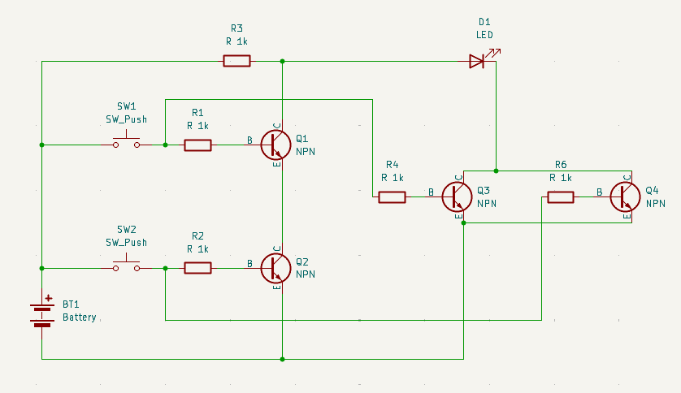
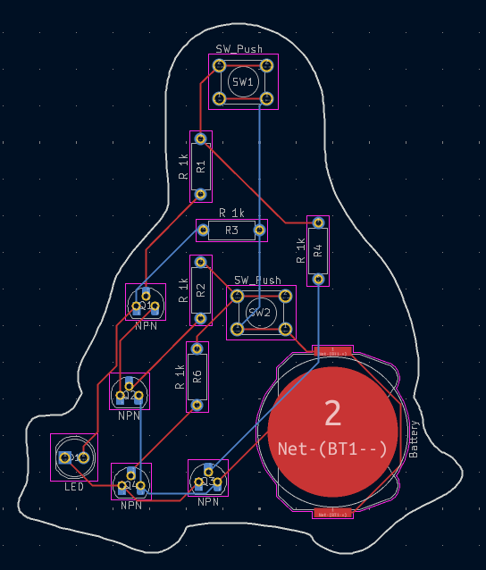
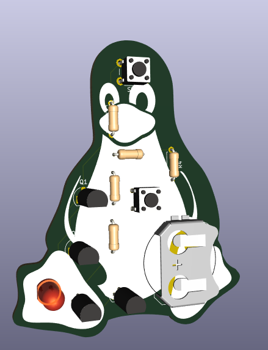
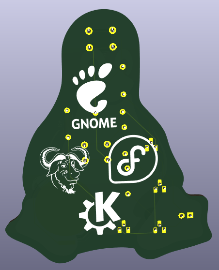

# Tux for Solder

This is a model of Tux, the mascot of the Linux kernel. Tux loves it when people pat his head or rub his belly (clicking the buttons), but he HATES it when people do both at the same time. The PCB is a XOR gate that makes the LED light up only when Tux is happy. This is my first PCB.

## Parts

- 1x Battery Holder
- 2x Push Buttons
- 5x 1k Resistors
- 4x NPN Transistors
- 1x LED

## Screenshots

## Slack Username
`Samvid`
